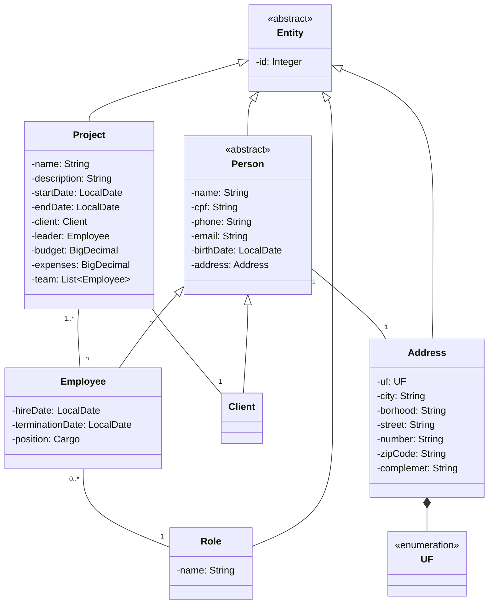

# Company System

# About project

# Class diagram

```mermaid
classDiagram
    class Entity {
        <<abstract>>
        -id: Integer
    }
    class Person {
        <<abstract>>
        -name: String
        -cpf: String
        -phone: String
        -email: String
        -birthDate: LocalDate
        -address: Address
    }
    class Role {
        -name: String
    }
    class Address {
        -uf: UF
        -city: String
        -borhood: String
        -street: String
        -number: String
        -zipCode: String
        -complemet: String
    }
    class UF {
        <<enumeration>>
    }
    class Client {
    }
    class Employee {
        -hireDate: LocalDate
        -terminationDate: LocalDate
        -position: Cargo
    }
    class Project {
        -name: String
        -description: String
        -startDate: LocalDate
        -endDate: LocalDate
        -client: Client
        -leader: Employee
        -budget: BigDecimal
        -expenses: BigDecimal
        -team: List~Employee~
    }
    
    Entity <|-- Project
    Entity <|-- Person
    Entity <|-- Role
    Entity <|-- Address
    Person <|-- Employee
    Person <|-- Client
    
    Employee "0..*"--"1" Role
    Address *-- UF
    Person "1"--"1" Address
    Project "n"--"1" Client
    Project "1..*"--"n" Employee
```

# Tools used

# How to execute the project

# Author
Matheus Fernando Vieira Pinto.

https://www.linkedin.com/in/matheus-fvp/